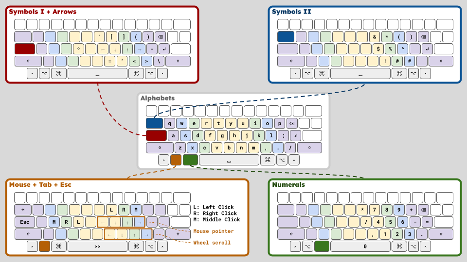

# Zen 40 Layout



A minimal layout for Karabiner-Elements. Alphanumerics, symbols, cursor movement and mouse control are all handled by about 40 keys around the home row, using layers.

## Layout

| Layer            | Key              | Behavior                                                                                                                         |
| ---------------- | ---------------- | -------------------------------------------------------------------------------------------------------------------------------- |
| Alphabets        | `[` / `'`        | ⌫ / ⏎                                                                                                                            |
|                  | Right ⌘          | ⌘ for shortcuts; tap alone for ⌃␣ (input source switch)                                                                          |
| Symbols I+Arrows | Caps Lock (hold) | Arrows on `h j k l`; `` ` [ ] ( ) `` on `y u i o p`, `-` on `;`, `=` on `n`, `'` on `m`, `< >` on `, .`, `\` on `/`; tap for Esc |
| Symbols II       | Tab (hold)       | Shifted numbers (`! @ # …`) on the numeral positions                                                                             |
| Numerals         | Left ⌘ (hold)    | Numpad on the right hand (`m , .` → `1 2 3`, `j k l` → `4 5 6`, `u i o` → `7 8 9`, `␣` → `0`)                                    |
| Mouse            | Left ⌥ (hold)    | Move on `h j k l`, click on `u i o` / `f d s`, scroll ← ↓ ↑ → on `n m , .`                                                       |
| Dvorak           | Left ⌥ + Esc     | Toggle the Dvorak layer (physical Esc key only); `/` is on the `q` key                                                           |

## How to install

Requirements: macOS, [Karabiner-Elements](https://karabiner-elements.pqrs.org/) and [bun](https://bun.sh/).

```
$ bun install
$ bun apply:default          # overwrite "Default profile"
$ bun apply 'Your profile'   # or overwrite another profile
```

The profile must already exist in the Karabiner-Elements UI.
